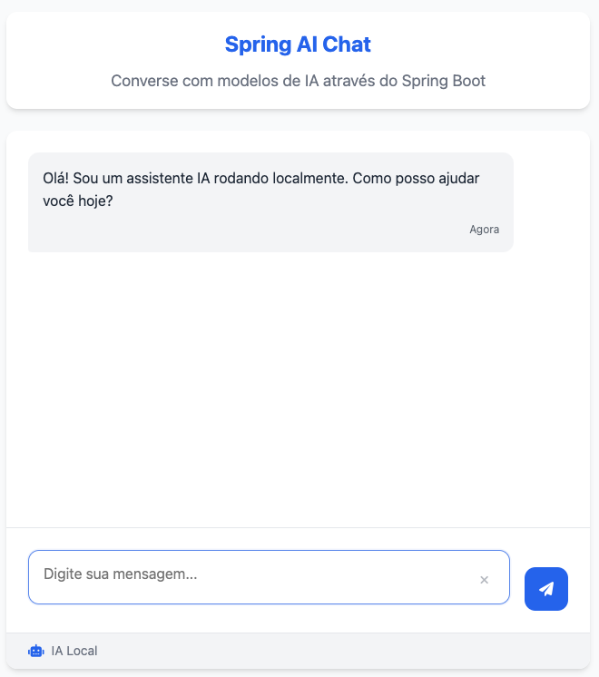

# 🤖 Spring AI Local Chat com Ollama

Este projeto demonstra a integração do **Spring AI** com modelos de linguagem (LLMs) locais usando **Ollama**.  
Além disso, mostra como expor uma **tool** (ferramenta) para o LLM, permitindo que ele chame uma API externa durante a conversa!

[📄 Documentação completa no GitHub Pages](https://cesarschutz.github.io/spring-ia-local-example/)

---

## 🌳 Estrutura do Projeto

```
spring-ia-local-example/
├── chat-img.png
├── docker-compose.yml
├── index.html
├── pom.xml
├── README.md
├── src/
│   ├── main/
│   │   ├── java/
│   │   │   └── com/
│   │   │       └── example/
│   │   │           └── springialocal/
│   │   │               ├── config/
│   │   │               │   └── RestTemplateConfig.java
│   │   │               ├── controller/
│   │   │               │   └── ChatController.java
│   │   │               ├── model/
│   │   │               │   ├── ChatRequest.java
│   │   │               │   └── ChatResponse.java
│   │   │               ├── service/
│   │   │               │   ├── ChatService.java
│   │   │               │   └── CountryApiService.java
│   │   │               ├── tools/
│   │   │               │   └── CountryApiTools.java
│   │   │               └── SpringIaLocalApplication.java
│   │   └── resources/
│   │       ├── application.yml
│   │       └── static/
│   │           ├── chat.html
│   │           └── index.html
│   └── test/
│       └── java/
│           └── com/
│               └── example/
│                   └── springialocal/
│                       └── controller/
│                           └── ChatControllerTest.java
├── .editorconfig
├── .gitignore
├── mvnw
└── mvnw.cmd
```

---

## 🚀 O que é demonstrado aqui?

- **Integração Spring AI + Ollama local**: envie prompts para um modelo LLM rodando localmente via Docker.
- **Uso de @Tool**: o LLM pode acionar métodos Java anotados com `@Tool` para buscar informações externas (exemplo: consultar dados de países em uma API pública).
- **Interface web moderna** e API REST para chat.
- **Exemplo de teste automatizado do endpoint principal.**

---

## 🐳 Subindo o Ollama com Docker Compose

Na raiz do projeto, execute:

```bash
docker-compose up -d
```

Isso irá baixar e iniciar o Ollama localmente na porta `11434`.

---

## 📥 Baixando um modelo de IA

Com o Ollama rodando, baixe um modelo (exemplo: qwen2.5:0.5b):

```bash
docker exec -it spring-ia-local-example-ollama-1 ollama pull qwen2.5:0.5b
```

Você pode usar outros modelos como: `llama2`, `mistral`, `codellama`, `phi2`, `gemma` e [outros disponíveis aqui](https://ollama.com/library).

---

## 🏃 Executando a aplicação Spring

```bash
./mvnw spring-boot:run
```

Acesse:
- Interface web: [http://localhost:8080](http://localhost:8080)
- API REST: [http://localhost:8080/api/chat](http://localhost:8080/api/chat)

---

## 💬 Como usar a API

### Endpoint

- **POST** `/api/chat`
- **Body**:
  ```json
  {
    "message": "Qual a capital da França?"
  }
  ```
- **Resposta**:
  ```json
  {
    "role": "assistant",
    "content": "Paris é a capital da França."
  }
  ```

### Exemplo com curl

```bash
curl -X POST http://localhost:8080/api/chat \
  -H "Content-Type: application/json" \
  -d '{"message": "Qual a capital do Brasil?"}'
```

---

## 🛠️ Como funciona a demonstração de @Tool

O projeto expõe uma **tool** chamada `getCountry` usando a anotação `@Tool`:

```java
  @Tool(name = "getCountry", description = "Sempre utilize essa ferramenta para consultar informações sobre um país")
  public String getCountry(String country) {
```

Quando o LLM recebe uma pergunta sobre países, ele pode decidir **chamar automaticamente essa tool** para buscar informações externas (por exemplo, dados do Brasil na API restcountries.com).  
Isso mostra como o LLM pode ser ampliado para agir como um "agente" que consulta APIs externas durante a conversa!

---

## ⚙️ Configuração

O arquivo `src/main/resources/application.yml` define o modelo padrão:

```yaml
spring:
  ai:
    ollama:
      base-url: http://localhost:11434
      chat:
        options:
          model: qwen2.5:0.5b
          temperature: 0.7
```

Altere o campo `model` para usar outro modelo baixado.

---

## 🧪 Testes

O projeto possui teste automatizado para o endpoint principal em `src/test/java/com/example/springialocal/controller/ChatControllerTest.java`.

---

## 🛠️ Dicas e comandos úteis

- Listar modelos instalados:
  ```bash
  docker exec -it spring-ia-local-example-ollama-1 ollama list
  ```
- Rodar modelo direto no terminal:
  ```bash
  docker exec -it spring-ia-local-example-ollama-1 ollama run qwen2.5:0.5b
  ```
- Remover um modelo:
  ```bash
  docker exec -it spring-ia-local-example-ollama-1 ollama rm qwen2.5:0.5b
  ```

---

## 🖼️ Interface Web

Acesse [http://localhost:8080](http://localhost:8080) para uma experiência visual de chat com IA local.



---

## ❓ Dúvidas ou problemas?

- Verifique se o Ollama está rodando (`docker ps`).
- Veja os logs do Ollama:
  ```bash
  docker logs spring-ia-local-example-ollama-1
  ```
- Veja os logs da aplicação Spring no terminal.

## 🛠️ Tecnologias Utilizadas

- [Java 21](https://www.oracle.com/java/technologies/downloads/)
- [Spring Boot](https://spring.io/projects/spring-boot)
- [Spring AI](https://spring.io/projects/spring-ai)
- [Docker & Compose](https://docs.docker.com/compose/)
- [Ollama](https://ollama.com/)
- [API REST](https://restfulapi.net/)
- [UI Web Responsiva](https://developer.mozilla.org/pt-BR/docs/Learn/CSS/CSS_layout/Responsive_Design)

---

## 🔗 Links Úteis

- [🌱 Spring AI (documentação oficial)](https://spring.io/projects/spring-ai)
- [💻 Exemplos oficiais Spring AI](https://github.com/spring-projects/spring-ai-examples)
- [🗄️ Ollama (site oficial)](https://ollama.com/)
- [🔍 Buscar modelos Ollama](https://ollama.com/search)